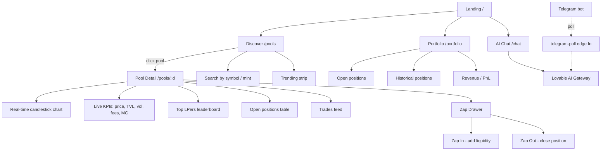
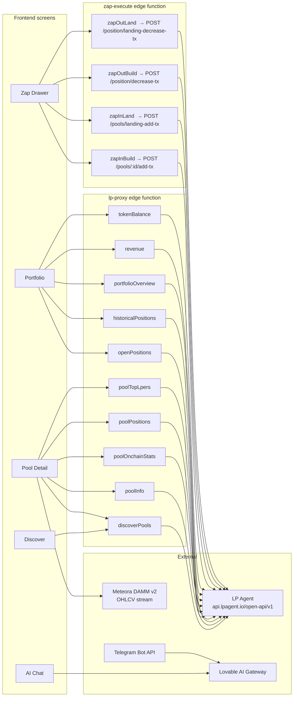

# LP AI Buddy

> A real-time, AI-assisted liquidity-provider cockpit for Solana DEX pools — powered by the **LP Agent API**.

Live preview: https://lp-ai-buddy.lovable.app

---

## 1. Introduction

**LP AI Buddy** is a trader/LP terminal for Solana that lets you:

- Discover the best Meteora / Raydium / Orca pools by APR, volume, fees, and TVL
- Open and close concentrated-liquidity positions in one click ("Zap In / Zap Out")
- Watch **real-time exchange-style candlestick charts** for each pool
- See the top wallets actively LPing in any pool, with their PnL, win rate, and ROI
- Chat with an AI co-pilot (Lovable AI Gateway) that knows every metric on screen
- Receive Telegram alerts when something interesting happens to a pool you watch

It is built entirely on top of the [LP Agent](https://lpagent.io) Open API — no scraping, no mock data.

---

## 2. The Problem

Providing liquidity on Solana is brutal:

| Pain point | Why it hurts |
|---|---|
| Pool data is fragmented across DEXes | Meteora, Raydium, Orca, Whirlpool — each has its own UI |
| OHLCV / candlestick views are missing on most LP dashboards | You cannot see *when* a pool's price will exit your range |
| Picking a "good" pool requires reading 6 tabs | APR, fee tier, vol/TVL ratio, IL risk, depth |
| Following smart LPs is impossible | You can see *positions* but not *which wallets are actually winning* |
| Opening a position needs 3+ swaps and manual range math | Most users mis-set their bin range and bleed fees |

---

## 3. The Solution

LP AI Buddy collapses all of that into **one Bybit-style terminal**:

- **One discovery feed** with live-pulsing 5m / 1h / 24h price changes
- **Real candlestick charts** (OHLCV from LP Agent + Meteora DAMM v2 stream) on 30m / 1H / 4H / 1D
- **Top LPers leaderboard** per pool — real wallets, real PnL, sortable
- **One-click Zap In / Out** that builds, signs, and lands the tx via LP Agent
- **AI chat** that can read the pool screen and answer "should I widen my range?"
- **Telegram bot poller** for alerts

---

## 4. How It Works

```text
┌─────────────────────────┐    ┌──────────────────────┐    ┌─────────────────┐
│  React + Vite frontend  │───▶│  Supabase Edge Fns   │───▶│  LP Agent API   │
│  (lightweight-charts,   │    │  lp-proxy            │    │  api.lpagent.io │
│   shadcn/ui, Tailwind)  │    │  zap-execute         │    └─────────────────┘
│                         │    │  chat                │           │
│                         │    │  telegram-poll       │    ┌─────────────────┐
└──────────┬──────────────┘    └──────────┬───────────┘    │ Meteora DAMM v2 │
           │                              │                │  (OHLCV stream) │
           │                              ▼                └─────────────────┘
           │                    ┌──────────────────┐
           └───────────────────▶│  Solana wallet   │
                                │  (Phantom / etc) │
                                └──────────────────┘
```

The frontend never touches the LP Agent API key directly — every call goes
through the `lp-proxy` edge function which injects `x-api-key` server-side and
short-caches GETs to keep the UI snappy.

---

## 5. Functional Map

What each screen does and where it gets its data.



---

## 6. API Map — Where each piece of data comes from

Every box below is a real call routed through `supabase/functions/lp-proxy`.



### LP Agent endpoints used

| Action | Method | Path | Used by |
|---|---|---|---|
| `discoverPools` | GET | `/pools/discover` | Discover, search |
| `poolInfo` | GET | `/pools/:id/info` | Pool Detail header |
| `poolOnchainStats` | GET | `/pools/:id/onchain-stats` | Live KPIs |
| `poolPositions` | GET | `/pools/:id/positions` | Open positions table |
| `poolTopLpers` | GET | `/pools/:id/top-lpers` | LPer leaderboard |
| `openPositions` | GET | `/lp-positions/opening` | Portfolio |
| `historicalPositions` | GET | `/lp-positions/historical` | Portfolio |
| `portfolioOverview` | GET | `/lp-positions/overview` | Portfolio header |
| `revenue` | GET | `/lp-positions/revenue/:owner` | PnL chart |
| `tokenBalance` | GET | `/token/balance` | Wallet |
| Zap In build | POST | `/pools/:id/add-tx` | Zap Drawer |
| Zap In land | POST | `/pools/landing-add-tx` | Zap Drawer |
| Zap Out build | POST | `/position/decrease-tx` | Zap Drawer |
| Zap Out land | POST | `/position/landing-decrease-tx` | Zap Drawer |

---

## 7. Tech Stack

- **Frontend:** React 18, Vite, TypeScript, Tailwind, shadcn/ui
- **Charts:** [`lightweight-charts`](https://github.com/tradingview/lightweight-charts) (the same library powering Bybit & TradingView)
- **Backend:** Lovable Cloud (Supabase) — Postgres + Edge Functions (Deno)
- **Wallet:** `@solana/wallet-adapter-react` (Phantom, Solflare, Backpack)
- **AI:** Lovable AI Gateway (Gemini 2.5 Flash by default)
- **Alerts:** Telegram Bot API via `telegram-poll` edge function

---

## 8. Local Dev

```bash
bun install
bun run dev
```

Set the `LPAGENT_API_KEY` secret in Lovable Cloud → Settings → Secrets.

---

## 9. Roadmap

- [ ] Devnet sandbox for Zap In / Out (LP Agent currently mainnet-only — see note in §10)
- [ ] WebSocket OHLCV (replace 5s polling)
- [ ] Range-recommendation AI agent
- [ ] Per-wallet "smart-LP" copy mode

---

## 10. Note on Devnet testing

The LP Agent Open API only indexes **mainnet-beta** Solana pools — Meteora,
Raydium and Orca do not run a maintained devnet deployment with real liquidity.
Because of that, Zap In / Out cannot be exercised on devnet end-to-end.

For safe end-to-end testing we recommend:

1. Use a **fresh Phantom wallet** with a small amount of mainnet SOL (~0.05).
2. Open a position in a **low-fee, high-volume pool** (e.g. SOL/USDC 0.01%).
3. Immediately Zap Out to confirm the round-trip.

This is a one-time ~$0.10 cost and exercises the exact same code path users hit in production.
